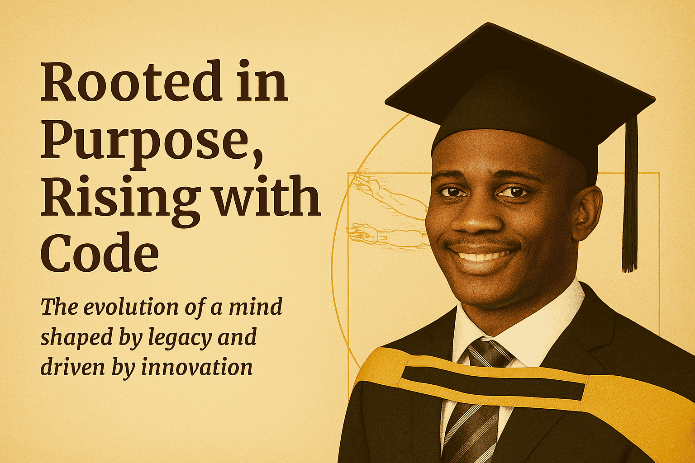

<!-- Cover Page -->

  <h1>🚀 Hackathon Portfolio</h1>
  <h2>Leonard Phokane</h2>
  
Mobile App Developer | Backend Developer | Frontend Developer

  
Driven by purpose, powered by culture, and committed to building scalable tech for Africa and beyond.

   
  
    
  <em>“Technology rooted in culture empowers us to build what truly matters.”</em>

---

<!-- Header -->

  🚀 Hackathon Portfolio by Leonard Phokane  
  PLP | 1MillionDevs4Africa | Ethical Tech

## 🌐 Live Preview

🔗 [Visit Portfolio](https://leonardphokane.github.io/hackathon-portfolio/)

---

## 🧪 Tech Stack

- HTML5 & CSS3  
- JavaScript & TypeScript  
- AOS.js for scroll animations  
- Responsive grid layout  
- GitHub Pages for deployment

---

## 🎨 Brand Narrative

This portfolio reflects:

- **Afro-futurism** — innovation through cultural identity  
- **Ethical Tech** — design with dignity and accessibility  
- **Cloud-readiness** — scalable systems and modular components

---

## 📦 Project Highlights

- 🔧 Modular project cards with embedded images  
- 📱 Mobile-first layout with smooth transitions  
- 🧠 Sections for Kazilink, Zulutech, Send Money App, Fairness Inspector, and AWS deployments  
- 📄 Footer with grid layout and hover effects  
- 🎯 Animated role banner: Full Stack Developer | Web Designer | Flutter App Developer

---

## 🚀 Hackathon Impact

This portfolio was born from Hackathon 1 — a collaborative challenge hosted by Power Learn Project (PLP) to ignite African creativity through full-stack development.

> “I believe technology rooted in culture empowers us to build what truly matters.” — Leonard Phokane

Built with resilience and vision, the project reflects storytelling through code, modular mastery, and ethical tech principles.

---

## 🏷 Community Tags

`#PowerLearnProject` `#PLPCommunity` `#1MillionDevs4Africa`

---

<section id="contact">
  <h2>Contact</h2>
   <!-- 👤 Profile Image -->
  
  
<strong>Author:</strong> Leonard Phokane

  
<strong>Email:</strong> 📧 leonardphokane1@gmail.com 

  
<strong>Phone:</strong> 📞 +27 72 350 7514

  <!-- 🌐 Personal Website Link -->
  
<strong>Personal Website:</strong> 
    <a href="https://phokane-creative-code.lovable.app/" target="_blank">
      phokane-creative-code.lovable.app
    </a>
  

</section>
 
  
🌍 South Africa

<!-- Footer -->

  📧 leonardphokane1@gmail.com • 📞 +27 72 350 7514 • 🌍 South Africa  
   
  <em>“Technology rooted in culture empowers us to build what truly matters.”</em>

<!-- Watermark -->

  © 2025 Leonard Phokane | Zulutech Labs

